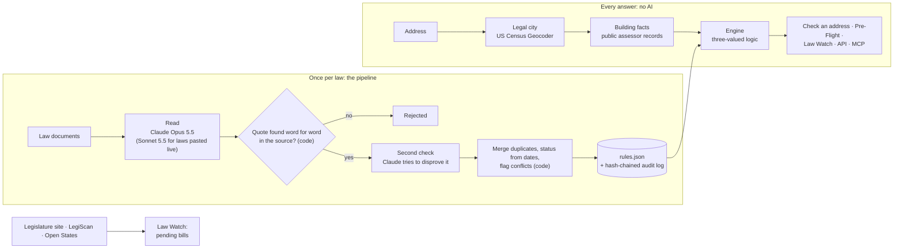

# Proofline

[](https://github.com/usv240/proofline/actions/workflows/ci.yml)

**Type an address. Proofline shows which housing laws protect that home, proves every answer with the law's own words, and when it is not sure, names the one fact that would settle it.**

Team **USV** (Ujwal Suresh Vanjare, solo) · RealPage challenge: Rental Housing Law Navigator · Hack-Nation 7th Global AI Hackathon · *Not legal advice.*

| | |
|---|---|
| Live demo | https://proofline-opal.vercel.app |
| Judges: start here | [Five things to try in three minutes](https://proofline-opal.vercel.app/judges) |
| Submission files | [`out/rules.json`](out/rules.json) · [`out/lookups.json`](out/lookups.json) · [`out/changes.json`](out/changes.json) |
| One-page method note | [/method-note](https://proofline-opal.vercel.app/method-note) · [PDF](public/proofline-method-note.pdf) |
| Check it yourself | `npm test` and `npm run verify` (below) |
| System status | [/status](https://proofline-opal.vercel.app/status) |

---

## The problem

Rent limits, eviction rules, deposits, fees and screening rules stack up by state and city, and they change. Most renters never find out which ones protect them, and AI tools often answer confidently and wrongly:

- Only **3%** of tenants facing eviction have a lawyer, against **81%** of landlords. ([NCCRC via NLIHC, 2023](https://nlihc.org/sites/default/files/2023-03/2023AG7-04_Right-to-Counsel.pdf))
- **43%** of rent-controlled tenants in Berkeley did not know they were covered. ([Berkeley Rent Board tenant survey, 2022](https://rentboard.berkeleyca.gov/sites/default/files/documents/2022%20Tenant%20Survey%20Presentation%20and%20Results.pdf))
- Leading AI legal research tools gave wrong or miscited answers **17% to 33%** of the time. ([Magesh et al., Journal of Empirical Legal Studies, 2025](https://onlinelibrary.wiley.com/doi/full/10.1111/jels.12413))

## What Proofline does

| Feature | What you get |
|---|---|
| **Check an address** (`/check`) | Every state and city rule that covers the building, marked applies, not sure yet, replaced by a local rule, not yet in effect, or pending. Each has the exact quote, source, retrieval date and as-of date. |
| **Rent Pre-Flight** (`/preflight`) | Check a rent increase, deposit, fee or pricing software **before** acting: Allowed, Not allowed (with the law's words), or Needs a person. Never suggests a way around a rule. |
| **"Not sure" that becomes sure** | When records lack a fact (for example the year built), the answer names it. Answer it and every rule on the page updates. |
| **Law Watch** (`/watch`) | Which homes a law change affects and from when, with conflict flags. Pending bills checked live against the state legislature, LegiScan and Open States. |
| **Bring your own** (`/byo`) | Paste a new law and watch it go through the same pipeline in about 10 to 30 seconds, or check your own list of addresses. |
| **Proof receipts** | Seal any answer; the server recomputes it later and catches a tampered copy. |
| **English and Spanish**, phone and desktop, light and dark mode, an "i" button explaining every term. |
| **Public API and MCP server** (`/developers`) | One-click API keys, OpenAPI spec, and MCP tools any AI assistant can call. |

## Try it in three minutes

1. Open a [1978 Los Angeles building](https://proofline-opal.vercel.app/check?address=A0107). Four rules say "Not sure yet". Tap "Around 1977" and watch them update.
2. Open [Pre-Flight for a San Francisco building](https://proofline-opal.vercel.app/preflight?address=A0016) and press "Check this change": a 9% increase is not allowed, the limit is 1.6%.
3. On any address page press "Get a receipt", then "Verify it now", then "Try a tampered copy".
4. Open the [New Jersey FAIR Act](https://proofline-opal.vercel.app/watch/T3): 140 homes affected from July 2027, 90 with a conflict flag. Then press "Check for changes" on [Law Watch](https://proofline-opal.vercel.app/watch).
5. On [How it works](https://proofline-opal.vercel.app/how-it-works#audit), press "Verify now" to re-check the audit log and every quote on the server.

## Results

All numbers are produced by script ([`src/generated/metrics.json`](src/generated/metrics.json)), not typed.

| Measure | Result |
|---|---|
| Law documents read | 83 of 87 in the manifest (55 official texts, 28 link-only pages fetched once, 4 blocked and recorded) |
| Rules extracted | 74 for the 13 places in scope, **100%** with the quote found word for word in its source |
| Addresses | **All 500** placed in their legal city (477 by US Census Geocoder, 23 by mailing city) |
| Change tests | **T1 to T5 as specified**: T1 250 CA homes · T2 90 (Jersey City 50, Hoboken 40, Newark 0) · T3 140 NJ, 90 conflict flags · T4 110 MA pending · T5 none |
| Invented rules | **0 in 2,010 checks** where the right answer is "no rule", "failed" or "not law yet" |
| Against plain AI | Same model with search over the same documents: claimed a rule in 2 of 33 no-rule questions and gave 1 quote not in the sources. Proofline: 0 and 0 ([`out/eval_baseline.json`](out/eval_baseline.json)) |
| Citations | 91% of "applies" answers quote the supplied official corpus; the rest quote labeled link-only pages |

## How it works

AI reads each law **once**. After that, every answer comes from tested code, the same way every time. No AI is called at answer time.



1. **Read.** Claude with structured outputs turns each document into rule records in the official schema, plus a coverage test over a fixed set of facts (units, year built, building type, owner occupancy, subsidy, tenancy length).
2. **Check quotes.** Code confirms every quote appears word for word in the source and stores the exact source text. No quote, no rule.
3. **Second check.** An independent pass tries to disprove each rule from the document alone. Refuted rules are dropped; partly supported ones get lower confidence.
4. **Merge and date.** The same law found in several documents becomes one record. Status (enacted, effective, pending, failed) is computed from the law's dates, never typed by the model. Conflicting dates are kept and flagged for a person.
5. **Answer.** For each address and date, the engine tests every rule with three-valued logic: a missing fact gives "unknown", never "no".

## Challenges, and how we solved them

| Challenge | What we did |
|---|---|
| Public records often lack the facts a law depends on (year built, unit counts, owner occupancy) | Made "unknown" a real answer that names the deciding fact and how to find it, instead of guessing. Unit counts are decoded from New Jersey MOD-IV descriptions (`3S-F-D-6U` = 6 units) and official use bands. |
| A building finished in a cutoff year (for example 1978 for Los Angeles rent control) | Year built is not the certificate-of-occupancy date, so the answer is "unknown" with that fact named. |
| Some laws were only available as link-only web pages, which do not count for citations | Kept and labeled them, and re-anchored each citation to the official corpus wherever it states the same rule (91% of "applies" answers). |
| PDF line breaks and hyphenation broke word-for-word quote matching | Matching normalizes whitespace, curly quotes and hyphenated line breaks, but still stores the exact source text. |
| The same law appears in many documents with different dates | One record per law, status computed from dates, and conflicting published dates flagged for human review. |
| Mailing city is not legal city (Dorchester is Boston, San Ysidro is San Diego) | Census Geocoder coordinates resolve the incorporated place. |
| Live law reading could be expensive | Corpus reading used Opus 5.5 once; laws pasted live use Sonnet 5.5 (about 10 seconds per law) with rate limits. |

**What worked:** separating "AI reads" from "code answers" made every result reproducible and testable. **What did not:** four source sites blocked automated access; we did not work around them and recorded each one.

## Limitations (measured, not hidden)

- About **14%** of answers are "unknown", mostly because public records omit year built (San Diego, Berkeley) or unit counts (Berkeley, Jersey City, Newark, Boston). The rate by city is on [How it works](https://proofline-opal.vercel.app/how-it-works).
- About **9%** of "applies" answers quote link-only pages (Hoboken, Newark, the Jersey City ban, the Los Angeles source-of-income article), labeled as such.
- Owner facts (owner-occupied, corporate owner) are never in public records; rules that depend on them stay "unknown" unless the user supplies the fact.
- Answers are as of 2026-10-01 for the 13 places in the brief; a new place takes one command but needs a person to approve it.

## Stretch goals and bonus

| From the challenge | Done | Where |
|---|---|---|
| Plain-language view for renters in English and Spanish | ✓ | "Espanol" on every address result, Rights Card |
| Confidence indicator and conflict flag on each answer | ✓ | Proof panel (confidence, second-check verdict); conflict flags in `lookups.json` |
| Extend to one new jurisdiction with the pipeline | ✓ | Bayonne, NJ, added live from its official ordinance: `npm run new-law -- --real` |
| Audit view: source, retrieval date, as-of date, reasoning | ✓ | Proof panel, `/how-it-works#audit`, proof receipts |
| **Bonus: surface the known open questions in the law** (README section 9) | ✓ all four | See below |

The four open questions the organizers listed, each flagged for human review with every published position and its source (quotes checked word for word, [`data/open_questions.json`](data/open_questions.json)):

1. **Berkeley's algorithmic ban** has two effective dates (January 2026 per a law-firm alert; March 1, 2026 per the ordinance text). Flagged on the Berkeley rule.
2. **New Jersey's FAIR Act** may preempt the Jersey City and Hoboken bans. 90 addresses carry a conflict flag (T3).
3. **Los Angeles's new rent formula** has two effective dates (February 2, 2026 per LAHD; January 24, 2026 per a landlord association). Flagged on the Los Angeles rule.
4. **California's screening-fee cap** has no single official 2026 figure. The $68.96 figure is shown as an estimate next to the statute's "$30 adjusted by CPI" text.

## Run it locally

Requires Node.js 22.

```bash
git clone https://github.com/usv240/proofline.git
cd proofline
npm install
cp .env.example .env      # optional: only needed to read new laws or issue API keys
npm run dev               # http://localhost:3000
```

The committed outputs are enough to run the whole site; no API key is needed for lookups, Pre-Flight, Law Watch or the API.

To re-run the pipeline (needs `ANTHROPIC_API_KEY`):

```bash
npm run pipeline          # read, check, second check, merge, translate, outputs, publish
npm run outputs           # deterministic part only: assemble, lookups, changes, publish
npm run new-law -- --file ordinance.pdf --place "Bayonne, NJ" --test J1 --real --url <source>
```

## Testing

```bash
npm test                  # 36 checks: engine unit tests + golden checks from the organizers' own statements
npm run verify            # audit chain intact, every quote found, engine reproduces all 500 lookups, no failed or pending law "applies"
BASE=http://localhost:3000 npm run e2e   # every page in light and dark, desktop and phone: accessibility (WCAG 2.2 AA), errors, layout, key flows
```

The organizers keep the official scorer, so these are our own checks. The golden checks use only facts the organizers stated (the brief's San Francisco example, the README cutoffs, T1 to T5, the four open questions). They caught two real bugs during the event, both fixed. CI runs type checks, `npm test`, `npm run verify` and a production build on every push.

## API and MCP

```bash
curl "https://proofline-opal.vercel.app/api/lookup?address=A0016"
curl -X POST https://proofline-opal.vercel.app/api/preflight -H "content-type: application/json" \
  -d '{"address":"A0016","action":{"kind":"rent_increase","current_rent":2000,"new_rent":2180}}'
```

Read endpoints work without a key (30 calls a minute); a free key from `/developers` raises the limits. OpenAPI spec: `/api/openapi.json`. MCP server: `npm run mcp` (tools `lookup_address`, `preflight_check`, `list_changes`).

## Key tools

TypeScript, Next.js 16 and React 19 on Vercel · Claude Opus 5.5 and Sonnet 5.5 (Anthropic API, structured outputs) · US Census Geocoder · LegiScan and Open States · public assessor data (DataSF, LA County eGIS, SANDAG/SanGIS, Alameda County, NJ MOD-IV, Boston and Cambridge assessing) · Vitest, Playwright and axe-core · Model Context Protocol SDK.

## Responsible design

- Every answer shows its source, quote, retrieval date and as-of date; nothing "applies" without a verified quote.
- Enacted, pending, not-yet-effective and failed laws are kept apart; failed and pending laws never show as in force.
- Missing facts give "unknown" with the deciding fact; conflicts and open questions are flagged for a person.
- New or changed laws are proposals until a person approves them.
- Pre-Flight never suggests ways around a rule. Every page and API response says it is not legal advice.
- Public data only; link-only pages were fetched once, read-only, and blocked sites were not worked around.

## Repository map

| Path | What |
|---|---|
| `src/lib/engine/` | The engine: three-valued coverage, lookup, precedence, change tracking, Pre-Flight, quote matching |
| `src/lib/pipeline/` | Prompts, schemas and model calls |
| `src/app/` | Website pages and API routes |
| `scripts/` | Pipeline steps, verify, new-law, link-only fetcher, baseline comparison |
| `data/starter/` | Untouched starter pack from the organizers |
| `data/corpus_ext/` | Link-only pages fetched once, with URL, date and SHA-256 |
| `data/open_questions.json` | The organizers' known open questions, with sourced positions |
| `out/` | Submission files, audit log, pipeline intermediates |
| `mcp/` | MCP server |
| `tests/` | Unit, golden and end-to-end tests |

License: MIT (see [LICENSE](LICENSE)). Law texts in `data/` are public records from their publishers. Built with Claude.
